# Mini Drive (미니 드라이브) 요구사항 분석서

문서번호 : [팀명]요구사항분석서_260515_Doc-001

| 항목 | 내용 |
|------|------|
| 소 속 | 소프트웨어 학과 |
| 팀 명 | |
| 팀 원 | 유 승 |
| 교 수 | |

---

## 제/개정 이력

| 버전 | 날짜 | 작성자 성명 | 제/개정사항 | 비고 |
|------|------|------------|------------|------|
| 1.0  |      |            | 요구사항 분석서 최초 작성 | |

---

## 목 차

1. 서론
   - 1.1 목적 및 범위
   - 1.2 용어 정의
   - 1.3 참조 문서
2. 시스템 개요
   - 2.1 소프트웨어 컨텍스트(Context)
   - 2.2 기능 분류 및 설명
3. 요구사항 명세
   - 3.1 정적 분석
   - 3.2 CRC 카드
   - 3.3 동적 분석
4. 인터페이스 분석
5. 제약사항
6. 요구사항 추적표
7. 참고문헌 및 부록

---

## 1. 서론

### 1.1 목적 및 범위

이 문서는 조직 내 협업을 위한 클라우드 파일 공유 시스템 **Mini Drive**의 요구사항을 조사하고 정의하는 문서이다. 본 시스템은 파일 버전 관리, 중앙 집중형 저장소, 역할 기반 접근 제어를 핵심 목표로 하며, 약 200명 규모의 조직 내부 사용자를 대상으로 한다. 이 문서는 기능적, 비기능적, 인터페이스에 요구되는 사항들을 정의한다.

### 1.2 용어 정의

| 용어 | 설명 |
|------|------|
| 클라우드 스토리지 | 인터넷을 통해 원격 서버에 데이터를 저장하고 접근하는 서비스 |
| 버전 관리 | 파일의 변경 이력을 기록하고 특정 시점으로 복원할 수 있는 기능 |
| OTP | One-Time Password. 일회용 인증 번호 |
| 역할 기반 접근 제어 | 사용자의 역할(관리자/일반 사용자)에 따라 접근 권한을 차등 부여하는 방식 |
| 감사 로그 | 파일 접근, 수정, 삭제 등의 행위를 실시간으로 기록한 이력 |
| 메타데이터 | 파일의 이름, 날짜, 유형, 크기 등 파일을 설명하는 부가 정보 |

### 1.3 참조 문서

- [팀명]프로젝트정의서_Doc-001.md
- [팀명]품질요소추정_Doc-002.md
- [팀명]프로젝트관리계획서_260425_Doc-001.pdf

---

## 2. 시스템 개요

### 2.1 소프트웨어 컨텍스트(Context)

#### 2.1.1 Actor Table

| Actor | Role |
|-------|------|
| 관리자 | 시스템을 관리하며, 사용자 계정 및 권한을 관리하는 사용자 |
| 일반 사용자 | 파일 업로드, 다운로드, 공유 등 시스템의 주요 기능을 사용하는 사용자 |
| 시스템 | 파일 저장, 버전 관리, 알림 발송 등 자동화된 처리를 수행하는 주체 |

#### 2.1.2 UseCase Diagram


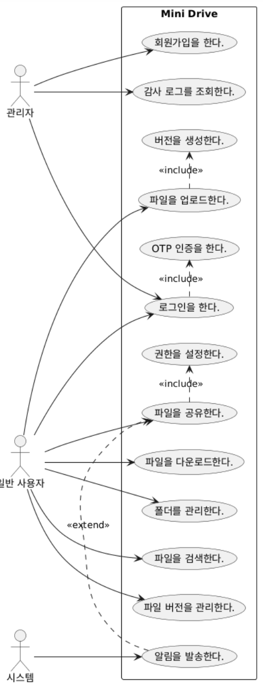


> 주요 유스 케이스: 회원가입, 로그인, 파일 업로드, 파일 다운로드, 폴더 관리, 파일 검색, 버전 관리, 파일 공유, 권한 설정, 감사 로그 조회

### 2.2 기능 분류 및 설명

#### 2.2.1 UseCase Description

---

**Use Case Name : 회원가입을 한다.**
| 항목 | 내용 |
|------|------|
| ID | U_01 |
| Importance Level | High |
| Primary Actor | 관리자 |
| Use Case Type | Detail, essential |

**Brief Description :** 이 Use-Case는 관리자가 신규 사용자 계정을 생성하는 Use Case를 표현한다.

**Stakeholders and Interests**
- 관리자 : 조직 내 사용자를 등록하고 시스템 접근 권한을 부여하길 원한다.

**Trigger :** 관리자는 사용자 등록 버튼을 누른다.

**Relationships**
- Association : 관리자
- Include :
- Extend :
- Generalization :

**Normal Flow of Events :**
1. 관리자는 사용자 아이디, 비밀번호, 이메일 주소, 역할을 입력한다.
2. 관리자는 등록하기 버튼을 누른다.
3. 시스템은 등록이 성공한 경우 사용자 목록 화면으로 이동한다.

**Alternate / Exceptional Flows :**
- 2.a1 : 공란이 있을 경우 시스템은 등록 실패 이유를 화면에 출력한다.
- 2.a2 : 동일한 아이디 또는 이메일이 존재하는 경우 시스템은 중복 오류 메시지를 출력한다.

---

**Use Case Name : 로그인을 한다.**
| 항목 | 내용 |
|------|------|
| ID | U_02 |
| Importance Level | High |
| Primary Actor | 관리자, 일반 사용자 |
| Use Case Type | Detail, essential |

**Brief Description :** 이 Use-Case는 사용자가 시스템에 로그인하는 Use Case를 표현한다.

**Stakeholders and Interests**
- 관리자, 일반 사용자 : 시스템에 접근하기 위해 로그인하길 원한다.

**Trigger :** 사용자는 로그인 버튼을 누른다.

**Relationships**
- Association : 관리자, 일반 사용자
- Include : OTP 인증을 한다.
- Extend :
- Generalization :

**Normal Flow of Events :**
1. 사용자는 아이디, 비밀번호를 입력한다.
2. 사용자는 로그인하기 버튼을 누른다.
3-1. 만약 로그인이 성공했다면 → S-1 : 로그인 성공
3-2. 만약 로그인이 실패했다면 → S-2 : 로그인 실패

**Subflows :**
- S-1 : 로그인 성공
  1. 시스템은 메인 화면으로 이동한다.
- S-2 : 로그인 실패
  1. 시스템은 로그인 실패 이유를 화면에 출력한다.

**Alternate / Exceptional Flows :**
- 2.a1 : OTP 인증 실패 시 시스템은 인증 실패 메시지를 출력한다.

---

**Use Case Name : 파일을 업로드한다.**
| 항목 | 내용 |
|------|------|
| ID | U_03 |
| Importance Level | High |
| Primary Actor | 일반 사용자 |
| Use Case Type | Detail, essential |

**Brief Description :** 이 Use-Case는 사용자가 파일을 서버에 업로드하는 Use Case를 표현한다.

**Stakeholders and Interests**
- 일반 사용자 : 자신의 파일을 클라우드에 안전하게 저장하길 원한다.

**Trigger :** 사용자는 파일 업로드 버튼을 누른다.

**Relationships**
- Association : 일반 사용자
- Include : 버전을 생성한다.
- Extend :
- Generalization :

**Normal Flow of Events :**
1. 사용자는 업로드할 파일을 선택한다. (드래그 앤 드롭 또는 파일 탐색기)
2. 사용자는 업로드 버튼을 누른다.
3. 시스템은 파일을 서버에 저장하고 버전 1로 등록한다.
4. 시스템은 업로드 완료 메시지를 화면에 출력한다.

**Alternate / Exceptional Flows :**
- 2.a1 : 파일 크기가 2GB를 초과하는 경우 시스템은 업로드 실패 이유를 출력한다.
- 2.a2 : 네트워크 오류 발생 시 시스템은 재시도 안내 메시지를 출력한다.

---

**Use Case Name : 파일을 다운로드한다.**
| 항목 | 내용 |
|------|------|
| ID | U_04 |
| Importance Level | High |
| Primary Actor | 일반 사용자 |
| Use Case Type | Detail, essential |

**Brief Description :** 이 Use-Case는 사용자가 저장된 파일을 다운로드하는 Use Case를 표현한다.

**Stakeholders and Interests**
- 일반 사용자 : 필요한 파일을 빠르게 다운로드하길 원한다.

**Trigger :** 사용자는 파일 다운로드 버튼을 누른다.

**Relationships**
- Association : 일반 사용자
- Include :
- Extend :
- Generalization :

**Normal Flow of Events :**
1. 사용자는 다운로드할 파일을 선택한다.
2. 사용자는 다운로드 버튼을 누른다.
3. 시스템은 해당 파일을 사용자 기기로 전송한다.

**Alternate / Exceptional Flows :**
- 2.a1 : 파일 접근 권한이 없을 경우 시스템은 권한 오류 메시지를 출력한다.

---

**Use Case Name : 폴더를 관리한다.**
| 항목 | 내용 |
|------|------|
| ID | U_05 |
| Importance Level | Mid |
| Primary Actor | 일반 사용자 |
| Use Case Type | Detail, essential |

**Brief Description :** 이 Use-Case는 사용자가 폴더를 생성, 이동, 삭제하는 Use Case를 표현한다.

**Stakeholders and Interests**
- 일반 사용자 : 계층형 폴더 구조로 파일을 체계적으로 관리하길 원한다.

**Trigger :** 사용자는 폴더 생성/이동/삭제 버튼을 누른다.

**Relationships**
- Association : 일반 사용자
- Include :
- Extend :
- Generalization :

**Normal Flow of Events :**
1. 사용자는 원하는 작업(생성/이동/삭제)을 선택한다.
2-1. 만약 생성을 선택한다면 → S-1 : 폴더 생성
2-2. 만약 이동을 선택한다면 → S-2 : 폴더 이동
2-3. 만약 삭제를 선택한다면 → S-3 : 폴더 삭제

**Subflows :**
- S-1 : 폴더 생성
  1. 사용자는 폴더명을 입력하고 확인 버튼을 누른다.
  2. 시스템은 해당 위치에 새 폴더를 생성한다.
- S-2 : 폴더 이동
  1. 사용자는 이동할 대상 위치를 선택한다.
  2. 시스템은 폴더를 해당 위치로 이동한다.
- S-3 : 폴더 삭제
  1. 사용자는 삭제 확인 버튼을 누른다.
  2. 시스템은 해당 폴더와 하위 파일을 삭제한다.

**Alternate / Exceptional Flows :**
- 2.a1 : 폴더명이 공란인 경우 시스템은 생성 실패 이유를 출력한다.

---

**Use Case Name : 파일을 검색한다.**
| 항목 | 내용 |
|------|------|
| ID | U_06 |
| Importance Level | High |
| Primary Actor | 일반 사용자 |
| Use Case Type | Detail, essential |

**Brief Description :** 이 Use-Case는 사용자가 메타데이터 기반으로 파일을 검색하는 Use Case를 표현한다.

**Stakeholders and Interests**
- 일반 사용자 : 파일명, 날짜, 유형으로 원하는 파일을 1초 이내에 찾길 원한다.

**Trigger :** 사용자는 검색어를 입력하고 검색 버튼을 누른다.

**Relationships**
- Association : 일반 사용자
- Include :
- Extend :
- Generalization :

**Normal Flow of Events :**
1. 사용자는 검색 조건(이름, 날짜, 유형)을 입력한다.
2. 사용자는 검색 버튼을 누른다.
3. 시스템은 조건에 해당하는 파일 목록을 1초 이내에 출력한다.

**Alternate / Exceptional Flows :**
- 3.a1 : 검색 결과가 없는 경우 시스템은 결과 없음 메시지를 출력한다.

---

**Use Case Name : 파일 버전을 관리한다.**
| 항목 | 내용 |
|------|------|
| ID | U_07 |
| Importance Level | High |
| Primary Actor | 일반 사용자 |
| Use Case Type | Detail, essential |

**Brief Description :** 이 Use-Case는 사용자가 파일의 이전 버전을 조회하고 복원하는 Use Case를 표현한다.

**Stakeholders and Interests**
- 일반 사용자 : 최신 버전과 과거 버전을 비교하고 필요 시 이전 버전으로 복원하길 원한다.

**Trigger :** 사용자는 버전 관리 버튼을 누른다.

**Relationships**
- Association : 일반 사용자
- Include :
- Extend :
- Generalization :

**Normal Flow of Events :**
1. 사용자는 버전 목록을 조회한다. (최소 10개 이상 보관)
2. 사용자는 복원할 버전을 선택한다.
3. 사용자는 복원하기 버튼을 누른다.
4. 시스템은 해당 버전의 파일로 복원한다.

**Alternate / Exceptional Flows :**
- 3.a1 : 복원 실패 시 시스템은 오류 메시지를 출력한다.

---

**Use Case Name : 파일을 공유한다.**
| 항목 | 내용 |
|------|------|
| ID | U_08 |
| Importance Level | High |
| Primary Actor | 일반 사용자 |
| Use Case Type | Detail, essential |

**Brief Description :** 이 Use-Case는 사용자가 파일 또는 폴더를 다른 사용자와 공유하는 Use Case를 표현한다.

**Stakeholders and Interests**
- 일반 사용자 : 파일을 특정 사용자에게 읽기 또는 편집 권한으로 공유하길 원한다.

**Trigger :** 사용자는 공유 버튼을 누른다.

**Relationships**
- Association : 일반 사용자
- Include : 권한을 설정한다.
- Extend :
- Generalization :

**Normal Flow of Events :**
1. 사용자는 공유할 파일/폴더를 선택한다.
2. 사용자는 공유 대상 사용자와 권한(읽기/편집)을 설정한다.
3. 사용자는 공유하기 버튼을 누른다.
4. 시스템은 해당 사용자에게 공유 알림을 발송한다.

**Alternate / Exceptional Flows :**
- 2.a1 : 공유 대상 사용자가 존재하지 않는 경우 시스템은 오류 메시지를 출력한다.

---

**Use Case Name : 감사 로그를 조회한다.**
| 항목 | 내용 |
|------|------|
| ID | U_09 |
| Importance Level | Mid |
| Primary Actor | 관리자 |
| Use Case Type | Detail, essential |

**Brief Description :** 이 Use-Case는 관리자가 파일 접근, 수정, 삭제 이력을 조회하는 Use Case를 표현한다.

**Stakeholders and Interests**
- 관리자 : 보안 감사를 위해 모든 파일 접근 이력을 실시간으로 확인하길 원한다.

**Trigger :** 관리자는 감사 로그 조회 버튼을 누른다.

**Relationships**
- Association : 관리자
- Include :
- Extend :
- Generalization :

**Normal Flow of Events :**
1. 관리자는 조회할 기간 및 사용자를 선택한다.
2. 관리자는 조회 버튼을 누른다.
3. 시스템은 해당 조건의 감사 로그 목록을 출력한다.

**Alternate / Exceptional Flows :**
- 3.a1 : 로그가 존재하지 않는 경우 시스템은 결과 없음 메시지를 출력한다.

---

**Use Case Name : 알림을 발송한다.**
| 항목 | 내용 |
|------|------|
| ID | U_10 |
| Importance Level | Mid |
| Primary Actor | 시스템 |
| Use Case Type | Detail, essential |

**Brief Description :** 이 Use-Case는 시스템이 파일 공유 또는 중요 이벤트 발생 시 사용자에게 이메일 알림을 발송하는 Use Case를 표현한다.

**Stakeholders and Interests**
- 시스템 : 공유 요청, 권한 변경, 비정상 접근 감지 시 관련 사용자에게 이메일을 전송한다.

**Trigger :** 파일 공유 또는 비정상 접근 감지 이벤트 발생 시

**Relationships**
- Association : 시스템
- Include :
- Extend :
- Generalization :

**Normal Flow of Events :**
1. 시스템은 이벤트 발생 여부를 확인한다.
2. 만약 공유 또는 비정상 접근이 감지된다면 → S-1 : 이메일 발송

**Subflows :**
- S-1 : 이메일 발송
  1. 시스템은 해당 사용자에게 이벤트 내용을 포함한 이메일을 전송한다.

---

## 3. 요구사항 명세
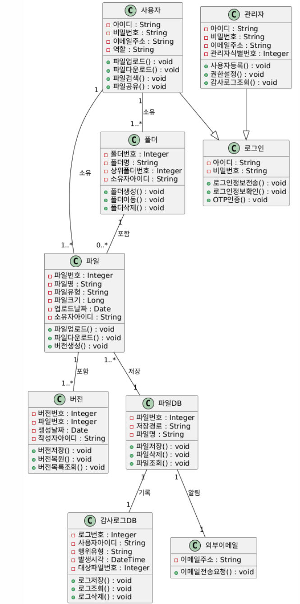
### 3.1 정적 분석

```

```

> 주요 클래스: 사용자, 관리자, 파일, 폴더, 버전, 파일DB, 감사로그DB, 외부이메일

### 3.2 CRC 카드

---

**Class Name: 사용자**
| 항목 | 내용 |
|------|------|
| ID | 01 |
| Type | Concrete, Domain |

**Description:** 시스템을 사용하는 일반 사용자를 나타낸다.
**Associated Use Case:** U_03, U_04, U_05, U_06, U_07, U_08

| Responsibilities | Collaborators |
|-----------------|---------------|
| 파일 업로드() : void | 파일DB |
| 파일 다운로드() : void | 파일DB |
| 파일 검색() : void | 파일DB |
| 버전 복원() : void | 버전DB |
| 파일 공유() : void | 관리자, 외부이메일 |

**Attributes**
- 아이디 : String
- 비밀번호 : String
- 이메일 주소 : String
- 역할 : String

**Relationships**
- Generalization (a-kind-of): 로그인
- Aggregation (has-parts): 파일, 폴더
- Other Associations: 관리자

---

**Class Name: 관리자**
| 항목 | 내용 |
|------|------|
| ID | 02 |
| Type | Concrete, Domain |

**Description:** 시스템을 관리하고 사용자 계정과 권한을 제어하는 관리자를 나타낸다.
**Associated Use Case:** U_01, U_02, U_09

| Responsibilities | Collaborators |
|-----------------|---------------|
| 사용자 등록() : void | 사용자DB |
| 권한 설정() : void | 사용자 |
| 감사 로그 조회() : void | 감사로그DB |

**Attributes**
- 아이디 : String
- 비밀번호 : String
- 이메일 주소 : String
- 관리자 식별번호 : Integer

**Relationships**
- Generalization (a-kind-of): 로그인
- Aggregation (has-parts): 사용자
- Other Associations: 감사로그DB

---

**Class Name: 파일**
| 항목 | 내용 |
|------|------|
| ID | 03 |
| Type | Concrete, Domain |

**Description:** 시스템에 저장된 파일을 나타낸다.
**Associated Use Case:** U_03, U_04, U_06, U_07, U_08

| Responsibilities | Collaborators |
|-----------------|---------------|
| 파일 업로드() : void | 사용자, 파일DB |
| 파일 다운로드() : void | 사용자, 파일DB |
| 버전 생성() : void | 버전DB |

**Attributes**
- 파일 번호 : Integer
- 파일명 : String
- 파일 유형 : String
- 파일 크기 : Long
- 업로드 날짜 : Date
- 소유자 아이디 : String

**Relationships**
- Generalization (a-kind-of):
- Aggregation (has-parts): 버전
- Other Associations: 폴더, 사용자

---

**Class Name: 폴더**
| 항목 | 내용 |
|------|------|
| ID | 04 |
| Type | Concrete, Domain |

**Description:** 파일을 계층적으로 분류하는 폴더를 나타낸다.
**Associated Use Case:** U_05

| Responsibilities | Collaborators |
|-----------------|---------------|
| 폴더 생성() : void | 사용자 |
| 폴더 이동() : void | 사용자 |
| 폴더 삭제() : void | 사용자 |

**Attributes**
- 폴더 번호 : Integer
- 폴더명 : String
- 상위 폴더 번호 : Integer
- 소유자 아이디 : String

**Relationships**
- Generalization (a-kind-of):
- Aggregation (has-parts): 파일
- Other Associations: 사용자

---

**Class Name: 버전**
| 항목 | 내용 |
|------|------|
| ID | 05 |
| Type | Concrete, Domain |

**Description:** 파일의 변경 이력을 버전 단위로 관리한다.
**Associated Use Case:** U_07

| Responsibilities | Collaborators |
|-----------------|---------------|
| 버전 저장() : void | 파일DB |
| 버전 복원() : void | 사용자 |
| 버전 목록 조회() : void | 사용자 |

**Attributes**
- 버전 번호 : Integer
- 파일 번호 : Integer
- 생성 날짜 : Date
- 작성자 아이디 : String

**Relationships**
- Generalization (a-kind-of): 파일
- Aggregation (has-parts):
- Other Associations: 파일DB

---

**Class Name: 파일DB**
| 항목 | 내용 |
|------|------|
| ID | 06 |
| Type | Concrete, Domain |

**Description:** 업로드된 파일과 버전 정보를 저장하는 DB를 나타낸다.
**Associated Use Case:** U_03, U_04, U_07

| Responsibilities | Collaborators |
|-----------------|---------------|
| 파일 저장() : void | 사용자 |
| 파일 삭제() : void | 관리자, 사용자 |
| 파일 조회() : void | 사용자 |
| 버전 저장() : void | 시스템 |

**Attributes**
- 파일 번호 : Integer
- 저장 경로 : String
- 파일명 : String

**Relationships**
- Generalization (a-kind-of): 파일
- Aggregation (has-parts):
- Other Associations: 감사로그DB

---

**Class Name: 감사로그DB**
| 항목 | 내용 |
|------|------|
| ID | 07 |
| Type | Concrete, Domain |

**Description:** 파일 접근, 수정, 삭제에 대한 감사 이력을 저장하는 DB를 나타낸다.
**Associated Use Case:** U_09

| Responsibilities | Collaborators |
|-----------------|---------------|
| 로그 저장() : void | 시스템 |
| 로그 조회() : void | 관리자 |
| 로그 삭제() : void | 관리자 |

**Attributes**
- 로그 번호 : Integer
- 사용자 아이디 : String
- 행위 유형 : String
- 발생 시각 : DateTime
- 대상 파일 번호 : Integer

**Relationships**
- Generalization (a-kind-of):
- Aggregation (has-parts):
- Other Associations: 파일DB

---

**Class Name: 외부이메일**
| 항목 | 내용 |
|------|------|
| ID | 08 |
| Type | Concrete, Domain |

**Description:** 이메일을 외부로 전송하는 역할을 하는 외부 시스템이다.
**Associated Use Case:** U_10

| Responsibilities | Collaborators |
|-----------------|---------------|
| 이메일 전송 요청() : void | 시스템 |

**Attributes**
- 이메일 주소 : String

**Relationships**
- Generalization (a-kind-of):
- Aggregation (has-parts):
- Other Associations: 사용자DB

---

### 3.3 동적 분석

#### 3.3.1 회원가입을 한다.

```
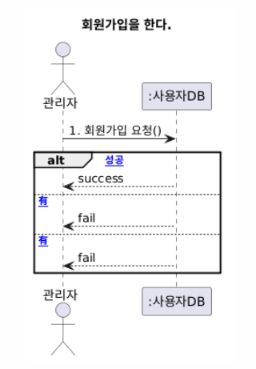
- 관리자 → :사용자DB : 1. 회원가입 요청
  - alt [가입 성공] : success
  - alt [공란 有] : fail
  - alt [중복 有] : fail
```

#### 3.3.2 로그인을 한다.

```
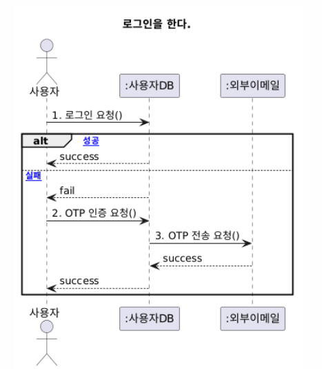
- 사용자 → :사용자DB : 1. 로그인 요청
  - alt [로그인 성공] : success
  - alt [로그인 실패] : fail → 2. OTP 인증 요청 → :외부이메일 : 3. OTP 전송 요청 → success
```

#### 3.3.3 파일을 업로드한다.

```
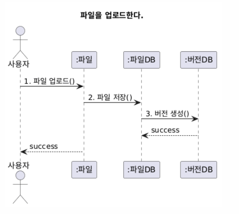
- 사용자 → :파일 : 1. 파일 업로드()
- :파일 → :파일DB : 2. 파일 저장()
- :파일DB → :버전DB : 3. 버전 생성()
- :파일DB ← :버전DB : success
- 사용자 ← :파일 : success
```

#### 3.3.4 파일을 다운로드한다.

```
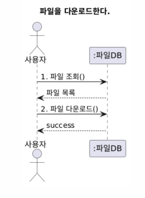
- 사용자 → :파일DB : 1. 파일 조회()
- 사용자 ← :파일DB : 파일 목록
- 사용자 → :파일DB : 2. 파일 다운로드()
- 사용자 ← :파일DB : success
```

#### 3.3.5 폴더를 관리한다.

```
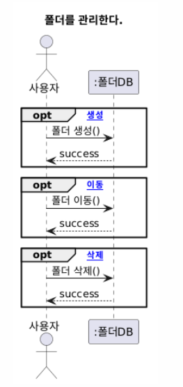
- 사용자 → :폴더DB : 1. 폴더 작업(생성/이동/삭제)
  - opt [생성] : 폴더 생성() → success
  - opt [이동] : 폴더 이동() → success
  - opt [삭제] : 폴더 삭제() → success
```

#### 3.3.6 파일을 검색한다.

```
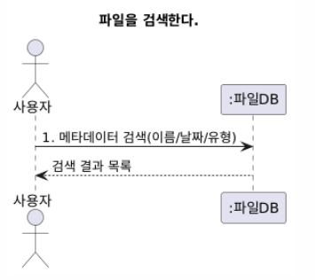
- 사용자 → :파일DB : 1. 메타데이터 검색(이름/날짜/유형)
- 사용자 ← :파일DB : 검색 결과 목록 (1초 이내)
```

#### 3.3.7 파일 버전을 관리한다.

```
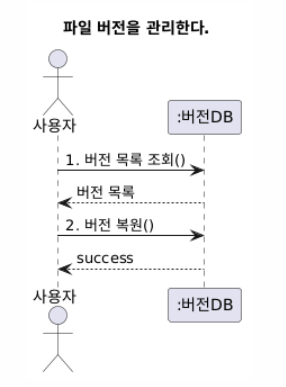
- 사용자 → :버전DB : 1. 버전 목록 조회()
- 사용자 ← :버전DB : 버전 목록
- 사용자 → :버전DB : 2. 버전 복원()
- 사용자 ← :버전DB : success
```

#### 3.3.8 파일을 공유한다.

```
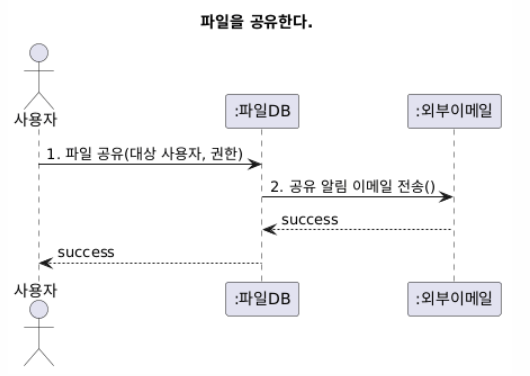
- 사용자 → :파일DB : 1. 파일 공유(대상 사용자, 권한)
- :파일DB → :외부이메일 : 2. 공유 알림 이메일 전송
- 사용자 ← :파일DB : success
```

#### 3.3.9 감사 로그를 조회한다.

```
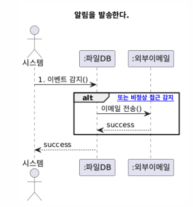
- 관리자 → :감사로그DB : 1. 로그 조회(기간, 사용자)
- 관리자 ← :감사로그DB : 로그 목록
```

#### 3.3.10 알림을 발송한다.

```

- 시스템 → :파일DB : 1. 이벤트 감지()
  - alt [공유/비정상 접근 감지] : :외부이메일 : 이메일 전송() → success
```

---

## 4. 인터페이스 분석

- 웹 브라우저 기반 UI (Chrome, Safari, Edge 지원)
- RESTful API를 통한 클라이언트-서버 통신
- 이메일 발송을 위한 외부 SMTP 서버 연동

---

## 5. 제약사항

- 단일 파일 최대 업로드 크기: 2GB
- 동시 접속 사용자 수: 최대 200명
- 파일 버전 보관 수: 최소 10개
- 응답 시간: 파일 검색 및 다운로드 평균 2초 이내
- 서비스 가용성: 99.99% 이상
- 지원 브라우저: Chrome, Safari, Edge 최신 버전

---

## 6. 요구사항 추적표

| 요구사항 | U_01 | U_02 | U_03 | U_04 | U_05 | U_06 | U_07 | U_08 | U_09 | U_10 |
|---------|------|------|------|------|------|------|------|------|------|------|
| FR_001  | O    |      |      |      |      |      |      |      |      |      |
| FR_002  |      | O    |      |      |      |      |      |      |      |      |
| FR_003  |      | O    |      |      |      |      |      |      |      |      |
| FR_004  |      |      | O    |      |      |      |      |      |      |      |
| FR_005  |      |      | O    |      |      |      |      |      |      |      |
| FR_006  |      |      |      | O    |      |      |      |      |      |      |
| FR_007  |      |      |      |      | O    |      |      |      |      |      |
| FR_008  |      |      |      |      |      | O    |      |      |      |      |
| FR_009  |      |      |      |      |      |      | O    |      |      |      |
| FR_010  |      |      |      |      |      |      | O    |      |      |      |
| FR_011  |      |      |      |      |      |      |      | O    |      |      |
| FR_012  |      |      |      |      |      |      |      | O    |      |      |
| FR_013  |      |      |      |      |      |      |      |      | O    |      |
| FR_014  |      |      |      |      |      |      |      |      |      | O    |
| FR_015  |      |      | O    |      |      |      | O    |      |      |      |
| FR_016  |      |      |      |      |      |      |      |      | O    | O    |

---

## 7. 참고문헌 및 부록

- ISO/IEC 25010 (SQuaRE) 품질 표준 모델
- [팀명]프로젝트정의서_Doc-001.md
- [팀명]품질요소추정_Doc-002.md
- [팀명]프로젝트관리계획서_260425_Doc-001.pdf
